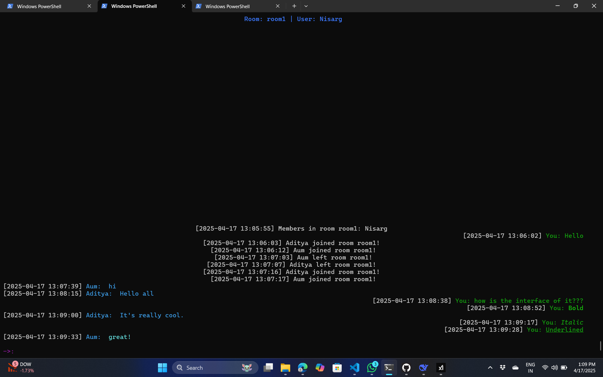

# 🌌 ChatSphere 💬

Welcome to **ChatSphere** 🌟, a dynamic, terminal-based chat application crafted in C++ that brings people together in vibrant, real-time chat rooms with a retro vibe and modern flair! Whether you're a fan of old-school IRC or craving a lightweight, customizable chat experience, ChatSphere is your go-to platform! 🚀

## ✨ Features

- 🖥️ **Multi-Platform Magic**: Seamlessly runs on Windows, Linux, and Unix systems.
- 🏠 **Dynamic Chat Rooms**: Create or join rooms instantly and connect with others.
- 🤫 **Private Messaging**: Whisper to users with `@username` for private chats.
- 🎨 **Rich Text Formatting**: Style your messages with **bold**, *italic*, and __underline__ using Markdown-like syntax.
- 🌈 **Colorful Interface**: Enjoy ANSI-colored usernames and messages for a lively terminal experience.
- 🎬 **Animated Welcome Screen**: Start with a dazzling ASCII art animation.
- 📜 **Message History**: New users get the full room context upon joining.
- ⚡ **Non-Blocking I/O**: Smooth, real-time communication with efficient socket handling.
- 📏 **Responsive Design**: Adapts to your terminal size for a perfect view.
- ⬆️⬇️ **Scrollable Chat**: Navigate message history with arrow keys.

## 📸 Screenshots

Below are some glimpses of ChatSphere in action:


*The dazzling ASCII welcome screen that greets you upon joining!*


*The colorful, responsive chat interface with formatted messages and private chats.*

*Note: Screenshots are illustrative. Actual appearance may vary based on your terminal settings.*

## 🚀 Getting Started

### 🛠️ Prerequisites
- A C++ compiler (e.g., g++, MSVC) 🖌️
- Windows: Winsock2 library (included by default) 🪟
- Linux/Unix: Standard networking libraries (usually pre-installed) 🐧

### 📦 Installation

1. **Clone the Repository**:
   ```bash
   git clone https://github.com/yourusername/ChatSphere.git
   cd ChatSphere
   ```

2. **Compile the Server**:
   ```bash
   g++ -o server new_server.cpp -pthread
   ```
   On Windows:
   ```bash
   g++ -o server new_server.cpp -lws2_32
   ```

3. **Compile the Client**:
   ```bash
   g++ -o client new_client.cpp -pthread
   ```
   On Windows:
   ```bash
   g++ -o client new_client.cpp -lws2_32
   ```

### 🏃 Running the Application

1. **Launch the Server**:
   ```bash
   ./server <port>
   ```
   Example: `./server 8080`

2. **Launch the Client**:
   ```bash
   ./client <server-ip> <port> <room-name>
   ```
   Example: `./client 127.0.0.1 8080 General`

3. **Enter Your Username**:
   When prompted, type your username and press Enter to dive into the animated welcome screen! 🎉

4. **Start Chatting**:
   - 💬 Send a message: Type and press Enter.
   - 🤫 Private message: Use `@username message` (e.g., `@Alice Hello!`).
   - 🎨 Format text: Use `**bold**`, `*italic*`, or `__underline__`.
   - ⬆️⬇️ Scroll messages: Use up/down arrow keys.
   - 🚪 Exit: Type `exit` and press Enter.

## 🎮 Example Usage

```bash
$ ./server 8080
Server running. Waiting for connections... 🌐

$ ./client 127.0.0.1 8080 General
Enter your name: Bob
```

**Terminal Output** (Client):
```
Room: General | User: Bob
[2025-07-24 14:01:23] Alice joined room General! 🎉
[2025-07-24 14:01:25] Alice: Hey, welcome to **ChatSphere**! 🌟
[2025-07-24 14:01:27] You: Hi Alice, *this is cool*! 😎
->: 
```

## 📂 Project Structure

- `new_server.cpp`: Powers the server, managing chat rooms, clients, and message broadcasting. 🖥️
- `new_client.cpp`: Drives the client, handling the UI, message formatting, and server communication. 💻
- `README.md`: This file, your guide to ChatSphere! 📖

## 🤝 Contributing

We welcome contributions to make ChatSphere even better! 🌍
1. Fork the repository.
2. Create a feature branch (`git checkout -b feature/AmazingFeature`).
3. Commit your changes (`git commit -m 'Add some AmazingFeature'`).
4. Push to the branch (`git push origin feature/AmazingFeature`).
5. Open a pull request.

Please follow the existing code style and include clear comments. 🧑‍💻

## 🙌 Acknowledgments

- Inspired by the nostalgia of IRC and classic chat apps. 🕰️
- Built with ❤️ for terminal enthusiasts and C++ coders.
- Thanks to the open-source community for their amazing tools and libraries! 🙏

## 📬 Contact

Got questions or ideas? Open an issue or reach out to the maintainers at [your.email@example.com](mailto:your.email@example.com). 📧

Happy chatting in the ChatSphere! 🚀💬
